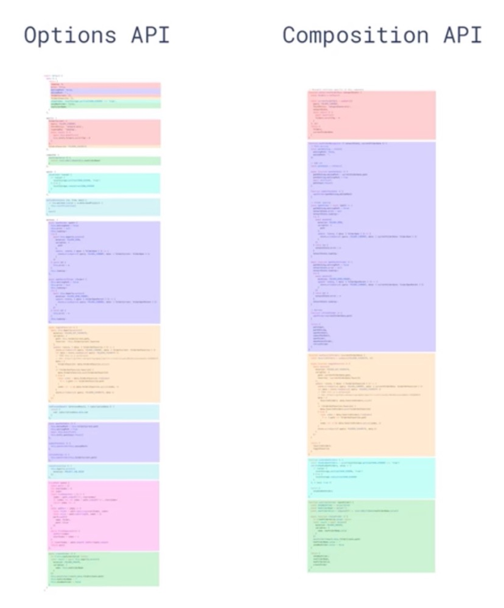

# Vue 3.0 与 Vue 2.0 对比
一. Vue 与 Vue 3.0
  + 响应式系统升级
    - vue 2.0 中 响应式系统的核心是 `defineProperty`，在初始化的时会遍历 `data` 中所有成员，通过 `defineProperty` 把对象的属性转换成 `setter` 和 `getter`，如果对象的属性也是对象的话，需要递归遍历处理每一个子对象的属性。  
      > + 因为以上操作都是在项目初始化中做的，所以会导致没有使用到的属性也被处理，增加了初始化时候的消耗
      > + 如果想动态对对象添加响应式属性需要使用 `$set`
      > + 并且 `defineProperty` 对一数组的方法，也无法监听到（如删除，下标操作，length赋值）

    - vue 3.0 使用 `es6` 中的 `proxy` 对象重写了响应式系统, `proxy` 的性能优于 `defineProperty` ，`proxy` 对象可以拦截属性的访问，赋值，删除等操作，不需要初始化时遍历所有属性，如果有多层属性嵌套的话，只有访问某个属性的时候才会递归处理下一级属性。
      + 可动监听动态新增的属性
      + 可监听删除属性
      + 可见听数组所以和 `length` 属性
      + 可作为模块单独使用

  + 编译优化
    - vue 2.0 中通过标记静态根节点，从而优化 `diff` 的过程。
      > 静态节点还会被 `diff`

    - vue 3.0 中标记和提升所有静态节点，`diff` 时只需要对比动态节点的内容。
      + fragments（片段）
        > 模板中不需要创建一个唯一的根节点（需要升级 vetur 插件）

      + 静态提升
        > 提升所有静态标签，在 `diff` 的时候不做比较

      + Patch flag 标记
        > 所有带 patch flag 节点会在 `diff` 的时候做比较，
        > 根据 flag 类型做特定比较（如 `/* TEXT */ ` 只对标签内容改变做比较, `/* TEXT, PROPS */ ` 对标签内容和属性的改变做比较）
        
      + 缓存事件处理函数
        > 在将模板编译为 render 函数时，会将事件处理函数做缓存

  + 源码体积优化
    - vue 3.0 中移除了一些不常用的 API
      > 例如：inline-template，filter 等
    - Tree-sharking
      > 依赖 `es modules` 通过编译过程中的静态分析，找到没有引入的模块，在打包时候直接过滤掉，从而使打包体积更小。
      > 除了 vue 核心模块，其他都是按需引用。

二. Composition API 与 Options API
  + Options API
    - 使用一个包含描述组件选项的对象来创建组件。（描述组件选项对象例如：data, methods, props 等）
      + 缺点： 同一个选项的代码会被拆分到不同的选项当中，对于后期维护和可读性造成一些困扰。

  + Composition API
    - vue 3.0 中新增的一组 API
    - 一组基于函数的 API
    - 可以更灵活组织组件的逻辑
  
  + Vue 3.0 支持 `Options API` 和 `Composition API`

  + 对比图  

    

三. Vue-cli 与 Vite
  + Vue-cli
    - 开发模式下必须打包后才可运行
    - 打包工具为 `webpack`

  + Vite
    - 快速冷启动
      > 使用浏览器原生支持的 `es modules` 加载模块，通过 `import` 导入模块。支持 `es modules` 的现代浏览器通过 `` 方式加载模块代码。因不需要打包项目，所以在开发模式下基本是秒开的。
    - 按需编译
      > 通过启动的服务器拦截浏览器发送的请求，浏览器会像服务器发送请求获取响应模块 `vite` 会对浏览器不识别的模块进行处理。如加载 `.vue` 扩展名的文件，`vite` 会对其做编译，并把结果返回给浏览器。
    - 模块热更新
      > 热更新的性能与模块总数无关

    - 生产环境下使用 `rollup` 打包
      > 基于 `es modules` 打包，不需要一些辅助函数（如 `babel` 转换 `import` 为 'require'）。现代浏览器都已经支持了 `es modules` 加载模块。