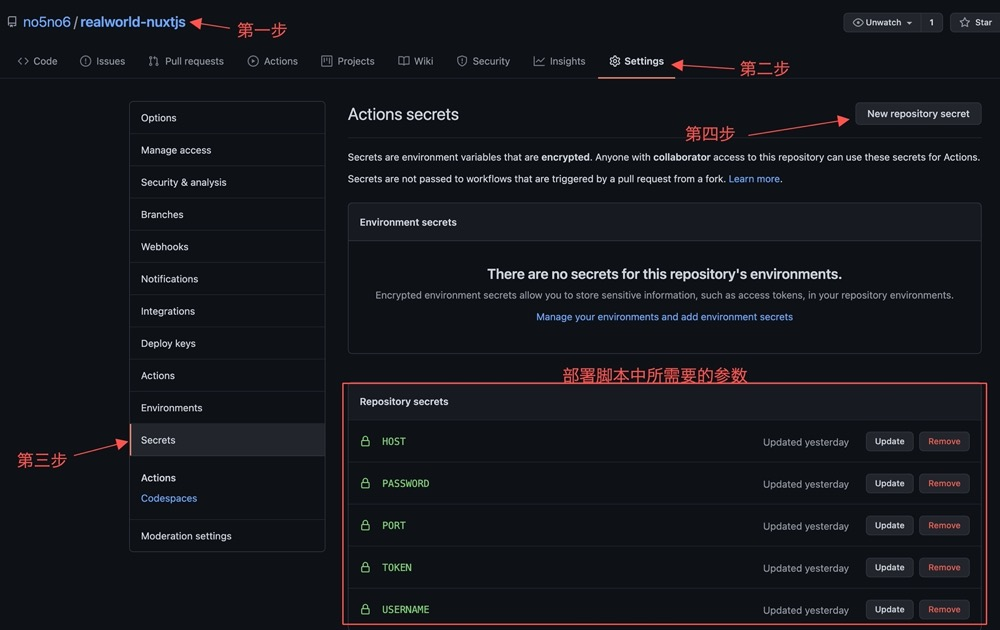

# nuxt 项目自动化部署
### 通过 `github action` 和 `pm2` 工具，实现代码的托管与部署

+ `pm2` 配置
  - 在需要部署的服务器上安装 `pm2` 工具。
    ```
      # yarn pm2 install
      $ sudo yarn global add pm2 --prefix /usr/local

      # npm pm2 install
      $ npm install pm2 -g
    ```
    > 注意：使用 `yarn` 做包管理的一定要按照上面方法安装

  - 项目 `package.json` 中添加 `build` 和 `start` 命令
    ```
      "scripts": {
        "serve": "nuxt",
        "build": "nuxt build",
        "start": "nuxt start"
      },
    ```

  - 项目根目录添加 `pm2` 配置文件 `ecosystem.config.js`
    ```
    module.exports = {
      apps: [
        {
          name: 'NuxtAppName',
          exec_mode: 'cluster',
          instances: 'max', // Or a number of instances
          script: './node_modules/nuxt/bin/nuxt.js',
          args: 'start'
        }
      ]
    }
    ```
    > 注意： `args` 参数要和 `package.json` 的 `scripts` 属性里配置的一样。
  
  - 项目 `nuxt.config.js` 文件里增加 `server` 配置。
    ```
      server: {
        host: '0.0.0.0',
        port: 3000
      }
    ```

+ `github action` 配置
  - 首先生成访问 `github` 的认证令牌（ token ）

    + 点击个人头像 
    + 点击 Settings 
    + 点击 Developer settings
    + 点击 personal access token 
    + 点击 Generate new token 按钮
    + 在 Note 里下上 TOKEN （或者其他名字
    + 勾选 repo 权限
    + 点击 Generate token 按钮

    

  - 在需要部署的项目中配置 `github action` 部署脚本所需参数。
    + 在 github 中打开自己项目页面
    + 点击项目的 settings
      > 注意： 是项目的设置，不是个人设置
    + 点击 Secrets
    + 点击 New repository secret
    + 生成以下参数
      - HOST
        > 部署服务器 IP
      - PASSWORD
        > 部署服务器的登录密码
      - PORT
        > 部署服务器远程访问端口号，一般为 22
      - TOKEN
        > 上一步生成的认证令牌 token
      - USERNAME
        > 部署服务器的登录用户名
      
    

  - 添加 `github action` 脚本
    + 根目录创建 .github 文件夹
    + 在 .github 文件夹中创建 workflows 文件夹
    + 在 workflows 文件夹中添加 [main.yml](main.yml) 文件
    
+ 使用说明
  - 部署
    - 创建标签 
      `git add tag v0.0.1`
      > v 后版本号根据自己需要添加
    - 触发部署
      `git push origin v0.0.1`
  - 查看
    + 打开 github 进入需要部署的项目首页
    + 点击 Action 标签查看部署详情
      > 如果遇到从 github 上下载 release 特别慢的情况，可以考虑转换下载源地址加速，使用此工具：https://d.serctl.com/